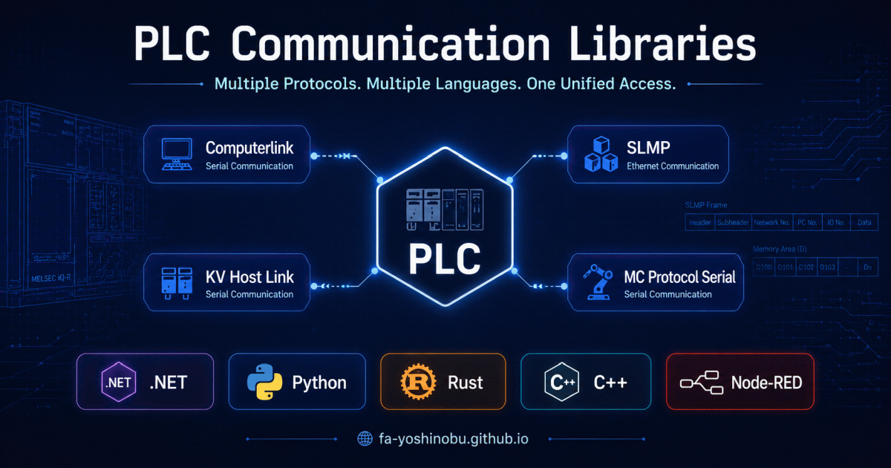

# PLC Communication Libraries

**Talk to MELSEC, KEYENCE KV, and TOYOPUC PLCs from .NET, Python, Rust, C++, and
Node-RED — one consistent design, continuously validated on real hardware.**



## Your first read in minutes

Every implementation follows the same model: pick a connection option set, pick
your PLC profile, read a device by name. This is a real SLMP read of `D100`
from a MELSEC iQ-R:

=== "Python"

    ```bash
    pip install plc-comm-slmp
    ```

    ```python
    import asyncio
    from slmp import SlmpConnectionOptions, SlmpTarget, open_and_connect, read_typed


    async def main() -> None:
        options = SlmpConnectionOptions(
            host="192.168.250.100", port=1025, transport="tcp",
            plc_profile="melsec:iq-r",
            default_target=SlmpTarget(network=0, station=0xFF, module_io=0x03FF, multidrop=0),
        )
        async with await open_and_connect(options) as client:
            value = await read_typed(client, "D100", "U")
            print(f"D100={value}")


    asyncio.run(main())
    ```

    [Getting started →](slmp/python/GETTING_STARTED.md)

=== ".NET"

    ```bash
    dotnet add package PlcComm.Slmp
    ```

    ```csharp
    using System;
    using PlcComm.Slmp;

    var options = new SlmpConnectionOptions(
        "192.168.250.100", SlmpPlcProfile.IqR, 1025,
        SlmpTransportMode.Tcp, SlmpTargetAddress.OwnStation);

    await using var client = await SlmpClientFactory.OpenAndConnectAsync(options);
    var value = await client.ReadTypedAsync("D100", "U");
    Console.WriteLine($"D100 = {value}");
    ```

    [Getting started →](slmp/dotnet/GETTING_STARTED.md)

=== "Rust"

    ```bash
    cargo add plc-comm-slmp
    ```

    ```rust
    use plc_comm_slmp::{
        read_typed, SlmpAddress, SlmpClient, SlmpConnectionOptions, SlmpPlcProfile,
    };

    #[tokio::main]
    async fn main() -> Result<(), Box<dyn std::error::Error>> {
        let options = SlmpConnectionOptions::new(
            "192.168.250.100", 1025,
            plc_comm_slmp::SlmpTransportMode::Tcp,
            plc_comm_slmp::SlmpTargetAddress::default(),
            SlmpPlcProfile::IqR,
        )?;

        let client = SlmpClient::connect(options).await?;
        let value = read_typed(&client, SlmpAddress::parse("D100", SlmpPlcProfile::IqR)?, "U").await?;
        println!("{:?}", value);
        client.close().await?;

        Ok(())
    }
    ```

    [Getting started →](slmp/rust/GETTING_STARTED.md)

=== "Node-RED"

    No code required. Install
    `@fa_yoshinobu/node-red-contrib-plc-comm-slmp` from Manage palette, create
    an `slmp-connection` config node with your PLC profile, then read `D100`
    with an `slmp-read` node.

    [Getting started →](slmp/nodered/GETTING_STARTED.md)

The same pattern works for every protocol below — each language has its own
Getting started, Usage guide, API reference, and Gotchas page.

## Which protocol do I need?

| Your PLC | Connection | Use |
|----------|-----------|-----|
| MELSEC (iQ-R/F/L, MX-R/F, Q, L) | Ethernet (TCP/UDP) | **SLMP** |
| MELSEC (iQ-R/L, Q, A) | RS-232C/RS-485 serial module | **MC Protocol Serial** |
| KEYENCE KV series | Ethernet (TCP/UDP) | **KV Host Link** |
| JTEKT TOYOPUC | Ethernet (TCP/UDP) | **Computerlink** |

For MELSEC PLCs, prefer **SLMP over Ethernet** whenever an Ethernet port or
communication unit is available — it is faster and easier to wire. Choose
**MC Protocol Serial** when only a serial communication module (RS-232C/RS-485)
is available, such as on legacy Q/A installations.

## Pick your language

| Protocol | Getting started |
|----------|----------------|
| **SLMP** (MELSEC, Ethernet) | [.NET](slmp/dotnet/GETTING_STARTED.md) · [Python](slmp/python/GETTING_STARTED.md) · [Rust](slmp/rust/GETTING_STARTED.md) · [C++ Arduino/PlatformIO](slmp/cpp/GETTING_STARTED.md) · [Node-RED](slmp/nodered/GETTING_STARTED.md) |
| **MC Protocol Serial** (MELSEC, serial) | [C++ Arduino/PlatformIO](mcprotocol/cpp/GETTING_STARTED.md) |
| **KV Host Link** (KEYENCE KV) | [.NET](hostlink/dotnet/GETTING_STARTED.md) · [Python](hostlink/python/GETTING_STARTED.md) · [Rust](hostlink/rust/GETTING_STARTED.md) · [Node-RED](hostlink/nodered/GETTING_STARTED.md) |
| **Computerlink** (JTEKT TOYOPUC) | [.NET](computerlink/dotnet/GETTING_STARTED.md) · [Python](computerlink/python/GETTING_STARTED.md) |

Package names, registries, sample code, and source repositories for every
pairing are collected in the [Package Matrix](package-matrix.md).

## Why choose these libraries?

- **Continuously validated on physical PLCs.** Device profiles and protocol
  behavior are exercised against real hardware and re-checked as PLCs evolve —
  not only against simulators. [Read the maintainer's message](project-vision.md).
- **One design across five languages.** Prototype in Node-RED or Python, ship
  in .NET, Rust, or C++ — the same options/profile/typed-read vocabulary
  everywhere, so knowledge transfers between projects and teams.
- **PLC model profiles built in.** Select a profile such as `melsec:iq-r` and
  the correct frame type, address grammar, and per-model device ranges are
  applied for you.
- **Documentation that tells you the sharp edges.** Every implementation ships
  a Getting started, Usage guide, API reference, and a candid Gotchas page.

## PLC Setup Guide

The library is only half of a working connection. These step-by-step guides
cover the PLC-side configuration for each supported hardware model, down to
the parameter screens.

| Protocol | Models covered |
|----------|---------------|
| MELSEC SLMP | iQ-R, iQ-F, iQ-L, MX-R, MX-F, QnUDV, QnU, LCPU, RJ71EN71, QJ71E71-100, LJ71E71-100 |
| KV Host Link | KV-X500, KV-8000, KV-7000, KV-5000, KV-XLE02 |
| Computerlink | TOYOPUC (minimum checklist; full guide in preparation) |
| MC Protocol Serial | MELSEC serial modules (iQ-R/L, Q, A) |

→ [Open PLC Setup Guide](plc-setup/index.md)

## License & support

Maintained by [fa-yoshinobu](https://github.com/fa-yoshinobu) ·
[FA Labo](https://fa-yoshinobu.github.io/FA_Labo/index.html)

For license terms, commercial support, sponsorship, and donations, see
[License & Support](support.md).
