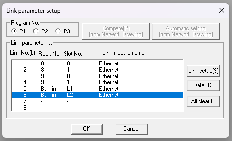
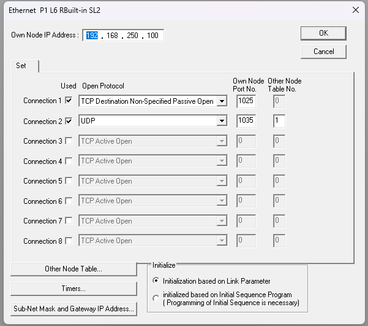
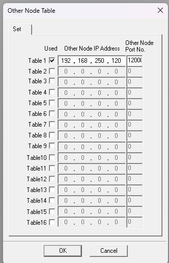

# TOYOPUC Computerlink — PCwin settings

Use this guide for the following TOYOPUC families configured with PCwin.

| Product family | Hardware |
| --- | --- |
| TOYOPUC Plus | Plus CPU, Plus EX2 |
| TOYOPUC PC10G | PC10G-1SP, PC10G, EF10, 2PORT-EFR |
| TOYOPUC PC3J | PC3JX-D, PC3JG |

TOYOPUC Nano uses the [PCwin2 guide](pcwin2.md) instead.

## What you need

- **Engineering tool:** PCwin
- **PLC network:** An IP address, subnet mask, and gateway appropriate for your network
- **After configuration:** Power cycle the PLC to apply the link parameters

## Example values used in this guide

| Parameter | Example value | Notes |
| --- | --- | --- |
| PLC IP address | `192.168.250.100` | Replace with the address assigned to the PLC |
| TCP port | `1025` | PLC-side Computerlink TCP port |
| UDP port | `1035` | PLC-side Computerlink UDP port |
| UDP peer PC | `192.168.250.120:12000` | Replace with the PC address and fixed UDP local port |

## PLC-side settings

### 1. Select the Ethernet link

Open **Parameter → Link Parameter**. Select the `Ethernet` entry for the
built-in port or communication module used by the project, then select
**Detail**. Rack, slot, link number, and port position depend on the PLC
configuration.

*Select the Ethernet link that is connected to the PC.*

### 2. Configure the TCP and UDP connections

Enter the following values in the Ethernet detail screen.

| Parameter | Setting |
| --- | --- |
| Own Node IP Address | `192.168.250.100` (example) |
| Connection 1 Used | Enabled |
| Connection 1 Open Protocol | `TCP Destination Non-Specified Passive Open` |
| Connection 1 Own Node Port No. | `1025` |
| Connection 1 Other Node Table No. | `0` |
| Connection 2 Used | Enabled |
| Connection 2 Open Protocol | `UDP` |
| Connection 2 Own Node Port No. | `1035` |
| Connection 2 Other Node Table No. | `1` |
| Initialize | `Initialization based on Link Parameter` |

Do not select initialization based on the Initial Sequence Program for this
procedure.

*TCP uses non-specified passive open; UDP references Other Node Table 1.*

### 3. Configure the UDP peer

Open **Other Node Table** and configure Table 1.

| Parameter | Setting |
| --- | --- |
| Table 1 Used | Enabled |
| Other Node IP Address | `192.168.250.120` (example PC address) |
| Other Node Port No. | `12000` (example fixed PC UDP port) |

*UDP requires a fixed peer entry in the PLC link parameters.*

The Computerlink application on the PC must bind its UDP local port to the
same value entered in this table. For this example, use `LocalPort = 12000` in
.NET or `local_port=12000` in Python. A value of `0` selects an arbitrary free
port and does not match this PLC configuration.

### 4. Apply the parameters

Write the updated parameters to the PLC, then power cycle the PLC. Start with a
read-only connection check after the PLC restarts.

## Connection check

| Transport | PLC endpoint | PC-side requirement |
| --- | --- | --- |
| TCP | `192.168.250.100:1025` | Connect normally; the PLC uses non-specified passive open |
| UDP | `192.168.250.100:1035` | Bind UDP local port `12000` |

For connection errors after the PLC-side setup is complete, see
[Computerlink Troubleshooting & Codes](troubleshooting-codes.md).
