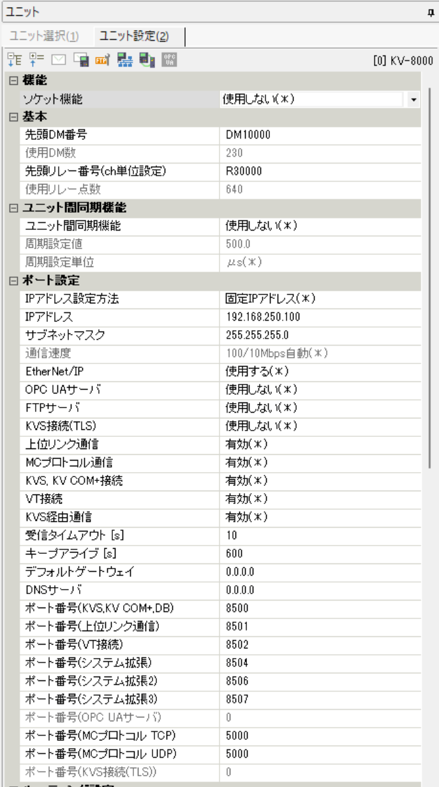

# KEYENCE KV-8000 — PLC-side settings

KEYENCE KV-8000 — built-in Ethernet port.

## What you need

- **Configuration tool:** KV Studio
- **Network:** Align IP address, subnet mask, and default gateway with your network environment.
- **After configuration:** Power cycle the PLC to apply the new parameters.

## Example values used in this guide

| Parameter | Example value | Notes |
|-----------|--------------|-------|
| IP address | `192.168.250.100` | Adapt to your network |
| Port | `8501` | Upper Link default |

## PLC-side settings

### Screen: Unit settings

| Parameter | Setting |
|-----------|---------|
| IP Address | `192.168.250.100` (example) |
| Subnet Mask | Match your network |
| Upper Link Communication | Enabled |
| Port Number | `8501` |

!!! tip "Full feature support"
    KV-8000 supports timer/counter preset writes (WS/WSS commands) and AT device access.

## Connecting with this library

| Parameter | Value |
|-----------|-------|
| Canonical profile | Not required for connection |
| Port (TCP) | `8501` |
| Port (UDP) | `8501` |

Code example:

=== "Python"

    ```python
    import asyncio

    from hostlink import HostLinkConnectionOptions, open_and_connect, read_typed


    async def main() -> None:
        options = HostLinkConnectionOptions(host="192.168.250.100", port=8501)
        async with await open_and_connect(options) as client:
            dm0 = await read_typed(client, "DM0", "U")
            print(f"DM0={dm0}")


    asyncio.run(main())
    ```

=== ".NET (C#)"

    ```csharp
    using PlcComm.KvHostLink;

    var options = new KvHostLinkConnectionOptions("192.168.250.100", 8501);
    await using var client = await KvHostLinkClientFactory.OpenAndConnectAsync(options);
    var dm0 = await client.ReadTypedAsync("DM0", "U");
    Console.WriteLine($"DM0={dm0}");
    ```

## Screenshots


*KV-8000 unit settings screen for upper link communication.*
