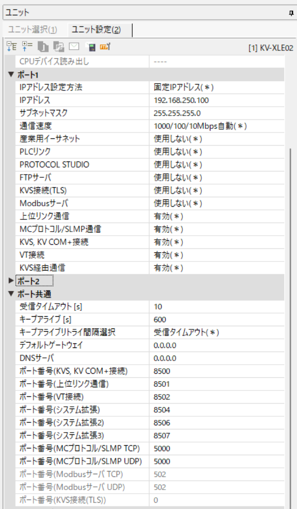

# KEYENCE KV-XLE02 — PLC-side settings

KEYENCE KV-XLE02 — Ethernet communication unit.

## What you need

- **Configuration tool:** KV Studio
- **Network:** Align IP address, subnet mask, and default gateway with your network environment.
- **After configuration:** Power cycle the PLC to apply the new parameters.

## Example values used in this guide

| Parameter | Example value | Notes |
|-----------|--------------|-------|
| IP address | `192.168.250.100` | Adapt to your network |
| Port | `8501` | Upper-level Link default |

## PLC-side settings

Use the KV-XLE02 when the KV series CPU does not have a built-in Ethernet port. It connects to the CPU via the expansion bus.

### Screen: Unit settings

| Parameter | Setting |
|-----------|---------|
| IP Address | `192.168.250.100` (example) |
| Subnet Mask | Required |
| Upper-level Communication | Enabled |
| Port Number (Upper-level) | `8501` |

## Connecting with this library

| Parameter | Value |
|-----------|-------|
| Canonical profile | Connected CPU profile, for example `keyence:kv-x500` |
| Port (TCP) | `8501` |
| Port (UDP) | `8501` |

Pass the connected CPU's canonical profile explicitly. The standard connection
helpers do not infer it from the PLC or communication unit.

Code example:

=== "Python"

    ```python
    import asyncio

    from hostlink import HostLinkConnectionOptions, open_and_connect, read_typed


    async def main() -> None:
        options = HostLinkConnectionOptions(
            host="192.168.250.100",
            plc_profile="keyence:kv-x500",
            port=8501,
        )
        async with await open_and_connect(options) as client:
            dm0 = await read_typed(client, "DM0", "U")
            print(f"DM0={dm0}")


    asyncio.run(main())
    ```

=== ".NET (C#)"

    ```csharp
    using PlcComm.KvHostLink;

    var options = new KvHostLinkConnectionOptions("192.168.250.100", "keyence:kv-x500", 8501);
    await using var client = await KvHostLinkClientFactory.OpenAndConnectAsync(options);
    var dm0 = await client.ReadTypedAsync("DM0", "U");
    Console.WriteLine($"DM0={dm0}");
    ```

The PLC-side settings on this page apply to every language. For
[Rust](../../hostlink/rust/GETTING_STARTED.md) and
[Node-RED](../../hostlink/nodered/GETTING_STARTED.md), start from each
library's Getting started.

## Screenshots


*KV-XLE02 unit settings screen for upper-level communication.*
## Troubleshooting

- [KV Host Link Troubleshooting & Codes](troubleshooting-codes.md)
