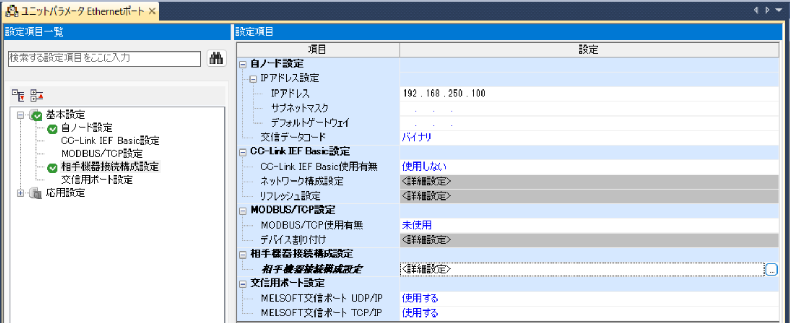
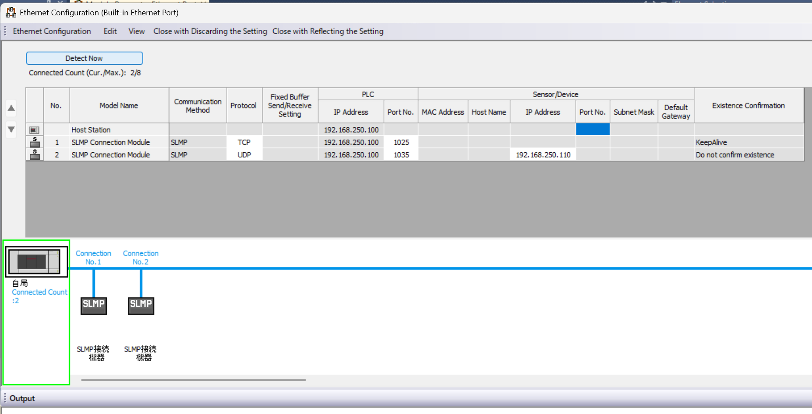

# MELSEC iQ-F — PLC-side settings

MELSEC iQ-F — built-in Ethernet port (CPU module).

## What you need

- **Configuration tool:** GX Works3
- **Network:** Align IP address, subnet mask, and default gateway with your network environment.
- **After configuration:** Power cycle the PLC to apply the new parameters.

## Example values used in this guide

| Parameter | Example value | Notes |
|-----------|--------------|-------|
| IP address | `192.168.250.100` | Adapt to your network |
| TCP port | `1025` | SLMP TCP |
| UDP port | `1035` | SLMP UDP |

## PLC-side settings

### Screen: Unit parameters

| Parameter | Setting |
|-----------|---------|
| IP Address | `192.168.250.100` (example) |
| Subnet Mask | Match your network |
| Default Gateway | Match your network |
| Communication Data Code | Binary |

iQ-F does not have "Write Permission During RUN" or "Open Method Setting" in the unit parameters screen. Those are configured in the connection settings screen instead.

### Screen: Connection settings

| Parameter | TCP | UDP |
|-----------|-----|-----|
| Communication Method | SLMP | SLMP |
| Protocol | TCP | UDP |
| Port Number | `1025` | `1035` |
| Remote Device IP Address | - | Enter the IP of the connecting PC |
| Keep-Alive | Enabled | Disabled |

!!! warning "DX/DY not valid for iQ-F"
    Use X and Y instead of DX and DY with the iQ-F profile.

## Connecting with this library

| Parameter | Value |
|-----------|-------|
| Canonical profile | `melsec:iq-f` |
| Port (TCP) | `1025` |
| Port (UDP) | `1035` |

Code example:

=== "Python"

    ```python
    import asyncio

    from slmp import SlmpConnectionOptions, SlmpTarget, open_and_connect, read_typed


    async def main() -> None:
        options = SlmpConnectionOptions(
            host="192.168.250.100",
            port=1025,
            transport="tcp",
            plc_profile="melsec:iq-f",
            default_target=SlmpTarget(network=0, station=0xFF, module_io=0x03FF, multidrop=0),
        )
        async with await open_and_connect(options) as client:
            value = await read_typed(client, "D100", "U")
            print(f"D100={value}")


    asyncio.run(main())
    ```

=== ".NET (C#)"

    ```csharp
    using PlcComm.Slmp;

    var options = new SlmpConnectionOptions(
        "192.168.250.100", SlmpPlcProfile.IqF, 1025,
        SlmpTransportMode.Tcp, SlmpTargetAddress.OwnStation);
    await using var client = await SlmpClientFactory.OpenAndConnectAsync(options);
    var value = await client.ReadTypedAsync("D100", "U");
    Console.WriteLine($"D100={value}");
    ```

The PLC-side settings on this page apply to every language. For
[Rust](../../slmp/rust/GETTING_STARTED.md),
[C++ (Arduino/PlatformIO)](../../slmp/cpp/GETTING_STARTED.md), and
[Node-RED](../../slmp/nodered/GETTING_STARTED.md), start from each
library's Getting started.

## Related SLMP docs

- [SLMP profile parameters](../../slmp/profile-reference/parameters.md)
- [SLMP Troubleshooting & Codes](troubleshooting-codes.md)

## Screenshots


*Unit parameters screen for the built-in Ethernet port.*


*Connection settings for SLMP communication.*
