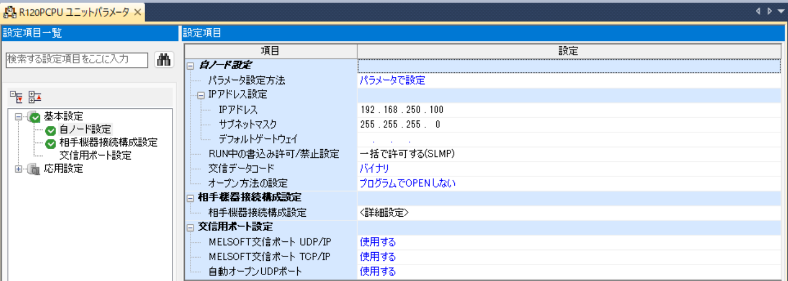
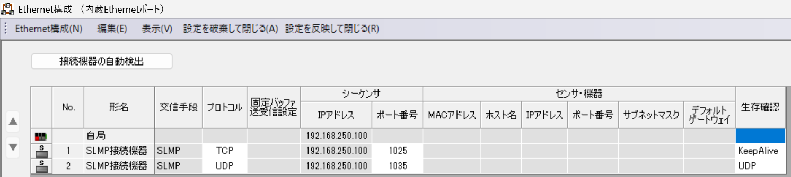

# MELSEC iQ-R — PLC-side settings

MELSEC iQ-R — built-in Ethernet port (CPU module).

## What you need

- **Configuration tool:** GX Works3
- **Network:** Align IP address, subnet mask, and default gateway with your network environment.
- **After configuration:** Power cycle the PLC to apply the new parameters.

## Example values used in this guide

| Parameter | Example value | Notes |
|-----------|--------------|-------|
| IP address | `192.168.250.100` | Adapt to your network |
| TCP port | `1025` | SLMP TCP |
| UDP port | `1035` | SLMP UDP |

## PLC-side settings

### Screen: Unit parameters

| Parameter | Setting |
|-----------|---------|
| IP Address | `192.168.250.100` (example) |
| Subnet Mask | Match your network |
| Default Gateway | Match your network |
| Write Permission During RUN | Permit all (SLMP) |
| Communication Data Code | Binary |
| Open Method Setting | Do not open via program |

### Screen: Remote device connection settings

| Parameter | TCP | UDP |
|-----------|-----|-----|
| Communication Method | SLMP | SLMP |
| Protocol | TCP | UDP |
| Port Number | `1025` | `1035` |
| Keep-Alive | Enabled | UDP |

## Connecting with this library

| Parameter | Value |
|-----------|-------|
| Profile string | `melsec:iq-r` |
| Port (TCP) | `1025` |
| Port (UDP) | `1035` |

Code example:

=== "Python"

    ```python
    import asyncio

    from slmp import SlmpConnectionOptions, open_and_connect, read_typed


    async def main() -> None:
        options = SlmpConnectionOptions(host="192.168.250.100", port=1025, plc_profile="melsec:iq-r")
        async with await open_and_connect(options) as client:
            value = await read_typed(client, "D100", "U")
            print(f"D100={value}")


    asyncio.run(main())
    ```

=== ".NET (C#)"

    ```csharp
    using PlcComm.Slmp;

    var options = new SlmpConnectionOptions("192.168.250.100", SlmpPlcProfile.IqR) { Port = 1025 };
    await using var client = await SlmpClientFactory.OpenAndConnectAsync(options);
    var value = await client.ReadTypedAsync("D100", "U");
    Console.WriteLine($"D100={value}");
    ```

## Screenshots


*Unit parameters screen for the built-in Ethernet port.*


*Remote device connection settings for SLMP communication.*
