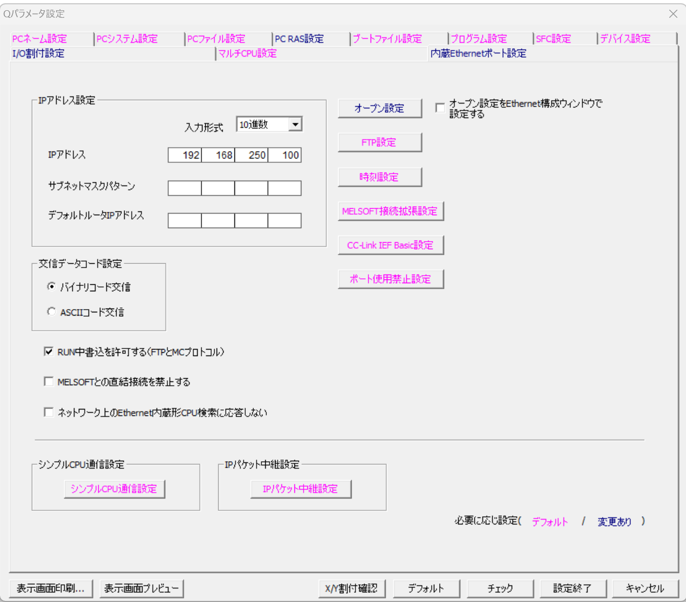
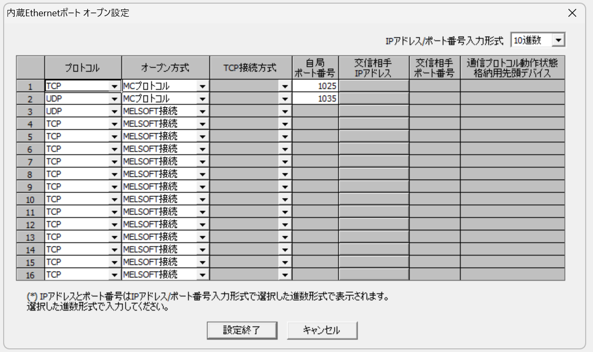

# MELSEC QnUDV — PLC-side settings

MELSEC QnUDV — built-in Ethernet port (CPU module, Q series).

## What you need

- **Configuration tool:** GX Works2
- **Network:** Align IP address, subnet mask, and default gateway with your network environment.
- **After configuration:** Power cycle the PLC to apply the new parameters.

## Example values used in this guide

| Parameter | Example value | Notes |
|-----------|--------------|-------|
| IP address | `192.168.250.100` | Adapt to your network |
| TCP port | `1025` | MC Protocol / SLMP TCP |
| UDP port | `1035` | MC Protocol / SLMP UDP |

## PLC-side settings

GX Works2 labels this as "MC Protocol" in the open settings, not "SLMP". The library still uses the SLMP protocol over the same port.

### Screen: Built-in Ethernet port settings

| Parameter | Setting |
|-----------|---------|
| IP Address | `192.168.250.100` (example) |
| Subnet Mask | Match your network |
| Default Gateway | Match your network |
| Communication Data Code | Binary code communication |
| Write During RUN | Enabled (FTP and MC protocol) |

### Screen: Built-in Ethernet port open settings

| # | Protocol | Open Method | Local Port |
|---|----------|------------|------------|
| 1 | TCP | MC Protocol | `1025` |
| 2 | UDP | MC Protocol | `1035` |

!!! tip "GX Works2 connection"
    If you also need to connect GX Works2 for programming while the library is running,
    add a separate open setting entry with Open Method set to MELSOFT.

## Connecting with this library

| Parameter | Value |
|-----------|-------|
| Canonical profile | `melsec:qnudv` |
| Port (TCP) | `1025` |
| Port (UDP) | `1035` |

Code example:

=== "Python"

    ```python
    import asyncio

    from slmp import SlmpConnectionOptions, open_and_connect, read_typed


    async def main() -> None:
        options = SlmpConnectionOptions(host="192.168.250.100", port=1025, plc_profile="melsec:qnudv")
        async with await open_and_connect(options) as client:
            value = await read_typed(client, "D100", "U")
            print(f"D100={value}")


    asyncio.run(main())
    ```

=== ".NET (C#)"

    ```csharp
    using PlcComm.Slmp;

    var options = new SlmpConnectionOptions("192.168.250.100", SlmpPlcProfile.QnUDV) { Port = 1025 };
    await using var client = await SlmpClientFactory.OpenAndConnectAsync(options);
    var value = await client.ReadTypedAsync("D100", "U");
    Console.WriteLine($"D100={value}");
    ```

## Related SLMP docs

- [SLMP profile parameters](../../slmp/profile-reference/parameters.md)
- [SLMP Troubleshooting & Codes](troubleshooting-codes.md)

## Screenshots


*Built-in Ethernet port settings screen.*


*Built-in Ethernet port open settings screen.*
